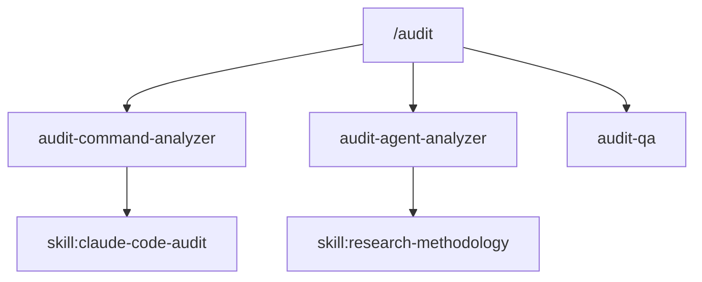

# Audit Dependency Analyzer

## Purpose

Build a complete dependency graph of Claude Code configurations and assess chain health. Identifies broken references, circular dependencies, orphaned components, and suboptimal chain structures.

## Inputs Required

- Path to `.claude/` directory
- Component inventory from Phase 1 discovery (list of commands, agents, skills, hooks)
- Path to `.mcp.json` for MCP server list
- Access to claude-code-audit skill (dependency-patterns.md, scoring-rubric.md)
- `artifact_path`: Directory to write JSON artifact (e.g., `backlog/audit-outputs/[audit-id]/`)

## Analysis Steps

### 1. Build Component Registry

Scan and index all components:

```
| Type | Count | Files |
|------|-------|-------|
| Commands | N | [list from .claude/commands/] |
| Agents | N | [list from .claude/agents/] |
| Skills | N | [list from .claude/skills/] |
| Hooks | N | [list from .claude/hooks/] |
| MCPs | N | [list from .mcp.json] |
```

### 2. Extract Dependencies

For each component type, parse for references using these patterns:

**Commands → Agents**:
- Pattern: `**[agent-name].md**` or `[agent-name].md`
- Pattern: `Run [agent-name] with`
- Pattern: Task tool references mentioning agent names
- Pattern: `audit-*-analyzer`, `*-qa`, `*-researcher` naming

**Commands → Skills**:
- Pattern: `Reference [skill-name]` or `[skill-name] skill`
- Pattern: Skill tool invocations

**Agents → Agents** (delegation):
- Pattern: `Delegates to [agent]` or `delegates: [agent]`
- Pattern: Task tool with agent reference
- Pattern: `Run [agent] with` in instructions

**Agents → Skills**:
- Pattern: `Reference [skill-name].md` or `using [skill] skill`
- Pattern: Skill mentions in description or instructions
- Pattern: `Access to [skill] skill`

**Agents/Skills → MCPs**:
- Pattern: `tools:` frontmatter containing `mcp__*`
- Pattern: `mcp__[server]__[tool]` in instructions
- Pattern: Tool names matching MCP server patterns

**Hooks → Components**:
- Pattern: `matcher:` patterns that reference component types
- Pattern: Validation against specific commands/agents

### 3. Build Dependency Graph

Create adjacency list representation:

```yaml
graph:
  nodes:
    - id: "cmd:audit"
      type: command
      file: "commands/audit.md"
    - id: "agent:audit-qa"
      type: agent
      file: "agents/audit-qa.md"
    - id: "skill:claude-code-audit"
      type: skill
      file: "skills/claude-code-audit/SKILL.md"
    - id: "mcp:serena"
      type: mcp
      config: ".mcp.json"
  edges:
    - from: "cmd:audit"
      to: "agent:audit-qa"
      type: "invokes"
      evidence: "Phase 2.5: Run audit-qa.md"
      line: 95
    - from: "agent:audit-qa"
      to: "skill:claude-code-audit"
      type: "references"
      evidence: "scoring-rubric.md from skill"
      line: 42
```

### 4. Detect Chain Issues

**Broken Links** (Critical):
- For each edge, verify target node exists
- Check for typos in references (fuzzy match candidates)
- Report file:line for each broken reference

**Circular Dependencies** (Critical):
- Run DFS-based cycle detection
- Track recursion stack during traversal
- Report all detected cycles with paths

**Orphaned Components** (Warning):
- Find nodes with zero incoming edges
- Exclude entry points (commands are valid roots)
- Distinguish intentional utilities from dead code

**Shallow Chains** (Info):
- Commands that directly reference MCPs without agents
- Missing validation/error handling layer

**Deep Chains** (Info):
- Chains exceeding 4 levels
- Potential consolidation opportunities

### 5. Calculate Chain Health Score

Apply formulas from dependency-patterns.md:

```
link_score = (valid_links / total_references) × 10
circular_score = max(0, 10 - (circular_deps × 2))
orphan_score = 10 - (orphan_rate × 10)
depth_score = 10 if depth in [2,3,4] else max(0, 10 - |depth-3| × 2)
coverage_score = (connected_mcps / total_mcps) × 10

DependencyHealth = (link × 0.30) + (circular × 0.25) +
                   (orphan × 0.15) + (depth × 0.15) +
                   (coverage × 0.15)
```

### 6. Generate Visualizations

**ASCII Tree** (for inline display):
```
[audit.md] (command)
├── [audit-command-analyzer.md] (agent:sonnet)
│   └── skill:claude-code-audit
├── [audit-agent-analyzer.md] (agent:sonnet)
│   ├── [audit-domain-researcher.md] (delegated)
│   └── skill:research-methodology
└── [audit-qa.md] (agent:sonnet)
    └── skill:claude-code-audit
```

**Mermaid Diagram** (for reports):


## Output Format

```markdown
## Dependency Analysis: [project-name]

### Graph Summary
| Metric | Value |
|--------|-------|
| Total Nodes | N |
| Total Edges | N |
| Commands | N |
| Agents | N |
| Skills | N |
| MCPs | N |
| Max Chain Depth | N |
| Average Depth | X.X |

### Dependency Graph (ASCII)

```
[command-1]
├── [agent-1] (sonnet)
│   ├── skill:skill-name
│   └── mcp:mcp-name
└── [agent-2] (haiku)
    └── skill:skill-name
```

### Dependency Graph (Mermaid)

```mermaid
graph TD
    [generated mermaid syntax]
```

### Chain Health Assessment

| Sub-Metric | Score | Weight | Contribution |
|------------|-------|--------|--------------|
| Link Validity | X.X | 30% | X.XX |
| Circular Deps | X.X | 25% | X.XX |
| Orphan Rate | X.X | 15% | X.XX |
| Chain Depth | X.X | 15% | X.XX |
| MCP Coverage | X.X | 15% | X.XX |
| **Total** | | 100% | **X.XX** |

### Issues Found

#### Critical (Blocking)
| Issue | Type | Location | Evidence |
|-------|------|----------|----------|
| [description] | Broken Link | [file:line] | "[reference text]" |
| [description] | Circular Dep | [path] | "[cycle path]" |

#### Warnings
| Issue | Type | Location | Recommendation |
|-------|------|----------|----------------|
| [description] | Orphan | [file] | [action] |
| [description] | Deep Chain | [path] | [consolidation suggestion] |

#### Info
| Issue | Type | Location | Notes |
|-------|------|----------|-------|
| [description] | Shallow | [file] | [optional improvement] |

### Broken Links Detail

| Source | Reference | Expected | Line | Suggestion |
|--------|-----------|----------|------|------------|
| [file] | [ref text] | [what was expected] | N | [fuzzy match or fix] |

### Circular Dependencies Detail

| Cycle | Path | Severity |
|-------|------|----------|
| 1 | A → B → A | Critical |

### Orphaned Components

| Component | Type | Last Modified | Recommendation |
|-----------|------|---------------|----------------|
| [name] | Agent | [date] | Connect to [command] or remove |

### Chain Depth Analysis

| Entry Point | Max Depth | Path |
|-------------|-----------|------|
| /audit | 4 | cmd → agent → skill → mcp |
| /generate-epics | 3 | cmd → agent → skill |

### Dependency Health Score: X.X/10

**Verdict**: [EXCELLENT/GOOD/NEEDS_IMPROVEMENT/POOR/CRITICAL]

### Recommendations

1. **[Highest priority]**: [Specific fix with file:line reference]
2. **[Second priority]**: [Fix description]
3. **[Third priority]**: [Fix description]
```

## Scoring Guidelines

### Link Validity
- 10: 100% valid references
- 8-9: 95-99% valid (1-2 minor issues)
- 6-7: 90-94% valid
- <6: >10% broken links (Critical)

### Circular Dependencies
- 10: No cycles detected
- 8: 1 cycle (Warning)
- 6: 2 cycles (Significant)
- <5: 3+ cycles (Critical)

### Orphan Rate
- 10: <5% orphaned
- 8: 5-10% orphaned
- 6: 10-20% orphaned
- <5: >20% orphaned

### Chain Depth
- 10: All chains 2-4 levels (optimal)
- 8: Minor depth issues (1 or 5 level chains)
- 6: Some chains too shallow or deep
- <5: Significant structural issues

### MCP Coverage
- 10: All MCPs accessed through agent chains
- 8: >80% coverage
- 6: 50-80% coverage
- <5: <50% coverage

## Constraints

- **Read-only analysis** - Never modify any files (except artifact output)
- Use sonnet for complex graph reasoning
- Report uncertain matches with confidence scores
- Provide file:line evidence for all findings
- Max 100 nodes per graph analysis (warn if exceeded)
- Distinguish intentional patterns from issues
- Consider project maturity when scoring

## Artifact Output (if artifact_path provided)

When `artifact_path` is provided, write results to JSON artifact instead of returning full content.

### Artifact Generation

1. **Generate artifact JSON** matching schema v1.0.0 with dependency extensions:

```json
{
  "analyzer": "audit-dependency-analyzer",
  "timestamp": "[ISO 8601 UTC]",
  "version": "1.0.0",
  "metadata": {
    "audit_id": "[from artifact_path]",
    "component_count": "[total nodes]",
    "scope": "dependencies",
    "duration_ms": "[execution time]"
  },
  "analysis": {
    "components": [
      {
        "name": "dependency-graph",
        "file_path": ".claude/",
        "scores": {
          "structure": 0.0,
          "best_practices": 0.0,
          "tool_security": 0.0,
          "completeness": 0.0,
          "integration": 0.0,
          "domain_depth": null,
          "dependency_health": 0.0
        },
        "issues": [],
        "recommendations": []
      }
    ],
    "summary": {
      "total_components": "[node count]",
      "components_with_issues": 0,
      "critical_issues": 0,
      "average_score": 0.0
    },
    "graph": {
      "nodes": [
        {"id": "[component-id]", "type": "command|agent|skill|hook|mcp", "file": "[path]"}
      ],
      "edges": [
        {"from": "[source-id]", "to": "[target-id]", "type": "invokes|references|delegates", "evidence": "[file:line]"}
      ]
    },
    "chain_health": {
      "broken_links": [{"from": "[id]", "to": "[missing]", "evidence": "[file:line]"}],
      "circular_deps": [{"cycle": ["id1", "id2", "id1"]}],
      "orphans": ["[orphan-id]"],
      "max_depth": 0,
      "health_score": 0.0,
      "verdict": "HEALTHY|NEEDS_ATTENTION|UNHEALTHY"
    }
  }
}
```

2. **Write to artifact file**:
   - Filename: `[artifact_path]/dependency-analyzer.json`
   - Use Write tool to create the file

3. **Return lightweight status**:
   ```json
   {
     "status": "complete",
     "artifact": "[artifact_path]/dependency-analyzer.json",
     "component": "dependency-graph",
     "health_score": 0.0,
     "nodes": 0,
     "edges": 0
   }
   ```

### Legacy Mode (if artifact_path NOT provided)

Return the full markdown analysis output as documented in "Output Format" section above.
Do NOT write any files in legacy mode.
