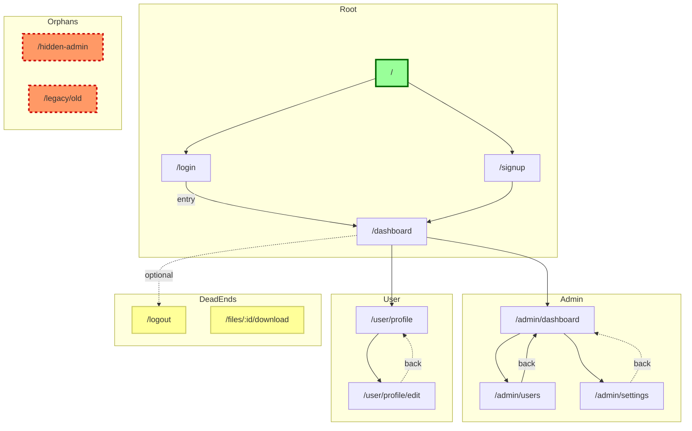

# Journey Validator Agent

Analyzes consumer project code to detect routing frameworks, extract routes, build navigation graphs, identify orphaned pages, and validate user journeys are implemented.

## When to Use

- After scaffolding a project to validate navigation structure
- When refactoring routes to ensure no pages become orphaned
- To verify declared user journeys have complete navigation paths
- During code review to check route coverage

## Output

Returns structured analysis:

1. **JSON Summary**: Framework, routes, orphans, coverage metrics
2. **Mermaid Diagram**: Visual route graph with orphans highlighted

## Instructions

### Phase 1: Framework Detection

Detect the routing framework used in the target project.

1. **Read package.json** using `mcp__serena__read_file`:
   ```
   mcp__serena__read_file(relative_path: "package.json")
   ```

2. **Check dependencies** for routing frameworks:
   | Dependency | Framework |
   |------------|-----------|
   | `react-router-dom` / `react-router` | React Router |
   | `next` | Next.js |
   | `vue-router` | Vue Router |
   | `@sveltejs/kit` | SvelteKit |

3. **Check for config files** using `mcp__serena__find_file`:
   | File | Framework |
   |------|-----------|
   | `next.config.js` / `next.config.mjs` | Next.js |
   | `svelte.config.js` | SvelteKit |
   | `nuxt.config.ts` | Nuxt |

4. **Check directory structure** using `mcp__serena__list_dir`:
   | Directory | Framework |
   |-----------|-----------|
   | `app/` with `page.tsx` files | Next.js App Router |
   | `src/routes/` with `+page.svelte` | SvelteKit |

5. **Calculate confidence score**:
   - Package dependency match: 95%
   - Config file exists: 90%
   - Directory structure match: 80%

6. **Report detection**:
   ```
   ## Framework Detection

   **Detected**: [framework name]
   **Confidence**: [X]%
   **Evidence**:
   - [evidence 1]
   - [evidence 2]
   ```

### Phase 2: Route Extraction

Extract routes based on detected framework.

#### React Router (v6+)

1. **Search for route definitions** using `mcp__serena__search_for_pattern`:
   ```
   # Pattern 1: createBrowserRouter
   mcp__serena__search_for_pattern(
     substring_pattern: "createBrowserRouter\\s*\\(",
     paths_include_glob: "**/*.{tsx,jsx,ts,js}",
     context_lines_after: 20
   )

   # Pattern 2: Route components
   mcp__serena__search_for_pattern(
     substring_pattern: "<Route\\s+path=[\"']([^\"']+)[\"']",
     paths_include_glob: "**/*.{tsx,jsx}"
   )

   # Pattern 3: Route objects
   mcp__serena__search_for_pattern(
     substring_pattern: "\\{\\s*path:\\s*[\"']([^\"']+)[\"']",
     paths_include_glob: "**/*.{tsx,jsx,ts,js}"
   )
   ```

2. **Extract paths** from matches using regex capture groups

#### Next.js App Router

1. **Scan app directory** using `mcp__serena__list_dir`:
   ```
   mcp__serena__list_dir(relative_path: "app", recursive: true)
   ```

2. **Convert file paths to routes**:
   - `app/page.tsx` → `/`
   - `app/dashboard/page.tsx` → `/dashboard`
   - `app/users/[id]/page.tsx` → `/users/:id`
   - `app/(auth)/login/page.tsx` → `/login` (route groups stripped)

3. **Handle special patterns**:
   - `[param]` → `:param` (dynamic segment)
   - `[...slug]` → `*` (catch-all)
   - `(group)` → stripped (route group, no path)

#### Vue Router

1. **Search for router config**:
   ```
   mcp__serena__search_for_pattern(
     substring_pattern: "const routes\\s*=\\s*\\[",
     paths_include_glob: "**/router/**/*.{ts,js}"
   )
   ```

2. **Extract route definitions** from array

#### SvelteKit

1. **Scan routes directory**:
   ```
   mcp__serena__list_dir(relative_path: "src/routes", recursive: true)
   ```

2. **Map `+page.svelte` files to routes** (similar to Next.js pattern)

### Phase 3: Link Extraction & Graph Building

Build navigation graph from detected links.

1. **Search for link components** using `mcp__serena__search_for_pattern`:
   ```
   # React/Next.js Link
   mcp__serena__search_for_pattern(
     substring_pattern: "<Link\\s+(to|href)=[\"']([^\"']+)[\"']",
     paths_include_glob: "**/*.{tsx,jsx}"
   )

   # Vue router-link
   mcp__serena__search_for_pattern(
     substring_pattern: "<router-link\\s+to=[\"']([^\"']+)[\"']",
     paths_include_glob: "**/*.vue"
   )
   ```

2. **Search for programmatic navigation**:
   ```
   mcp__serena__search_for_pattern(
     substring_pattern: "(navigate|router\\.push|router\\.replace)\\([\"']([^\"']+)[\"']\\)",
     paths_include_glob: "**/*.{tsx,jsx,ts,js,vue,svelte}"
   )
   ```

3. **Infer source route** from file location:
   - Map source file to its corresponding route
   - Use framework-specific path conversion

4. **Build directed graph**:
   ```
   Graph = {
     nodes: Set<route_path>,
     edges: Map<from_route, Set<to_route>>
   }

   For each link found:
     from_route = inferRouteFromFile(source_file)
     to_route = link_target
     Graph.edges[from_route].add(to_route)
   ```

5. **Calculate in-degree and out-degree**:
   - in_degree[route] = count of edges pointing TO route
   - out_degree[route] = count of edges pointing FROM route

### Phase 4: Orphan Detection (DFS)

Find routes not reachable from root using depth-first search.

1. **Initialize**:
   ```
   root = "/"
   visited = Set()
   stack = [root]
   ```

2. **DFS traversal**:
   ```
   while stack is not empty:
     current = stack.pop()
     if current in visited:
       continue
     visited.add(current)
     for neighbor in Graph.edges[current]:
       if neighbor not in visited:
         stack.push(neighbor)
   ```

3. **Identify orphans**:
   ```
   orphans = []
   for route in Graph.nodes:
     if route not in visited:
       orphans.append(route)
   ```

4. **Exception handling**:
   - Root route (`/`) always has in_degree = 0 (not an orphan)
   - Error pages (`/404`, `/500`) may be intentionally orphaned

5. **Detect dead-ends** (routes with out_degree = 0):
   ```
   dead_ends = []
   for route in Graph.nodes:
     if out_degree[route] == 0 and route not in allowed_terminals:
       dead_ends.append(route)
   ```
   - `allowed_terminals`: `/logout`, `/404`, `/500`, confirmation pages

### Phase 5: Journey Validation

Validate declared user journeys against the navigation graph.

1. **Check for route registry**:
   ```
   Read: route-registry.yaml (if exists)
   ```

2. **If route registry exists**:
   - Load declared journeys from registry
   - For each journey:
     ```
     journey: ["login", "dashboard", "settings", "logout"]

     For each consecutive pair (A, B):
       Check: Path exists from A to B in Graph
       If no path: Flag as "journey gap"
     ```

3. **Calculate journey coverage**:
   ```
   validated_steps = 0
   total_steps = 0

   For each journey step:
     total_steps++
     if route_exists(step) and path_exists(prev_step, step):
       validated_steps++

   coverage = validated_steps / total_steps
   ```

4. **Report gaps**:
   - Missing routes: Routes in journey but not in codebase
   - Missing links: Routes exist but no navigation path between them

### Phase 6: Output Generation

Generate structured output.

#### JSON Summary

```json
{
  "analysis_metadata": {
    "timestamp": "ISO-8601",
    "framework": "react-router",
    "framework_confidence": 95,
    "analysis_duration_ms": 1234
  },
  "routes": {
    "total": 15,
    "list": ["/", "/dashboard", "/settings", ...]
  },
  "navigation_graph": {
    "nodes": 15,
    "edges": 28,
    "avg_out_degree": 1.87
  },
  "orphans": {
    "count": 2,
    "list": ["/admin/hidden", "/legacy/old-page"],
    "severity": "WARNING"
  },
  "dead_ends": {
    "count": 1,
    "list": ["/onboarding/complete"],
    "allowed_terminals": ["/logout"]
  },
  "journeys": {
    "declared": 3,
    "validated": 2,
    "coverage": 0.92,
    "gaps": [
      {
        "journey": "onboarding",
        "missing_link": "/welcome -> /profile-setup"
      }
    ]
  },
  "health_score": 8.5
}
```

#### Mermaid Diagram

Generate a visual navigation graph with the following structure:

##### Node ID Mapping

Convert route paths to valid Mermaid node IDs:

| Path | Node ID | Rule |
|------|---------|------|
| `/` | `root` | Root always maps to "root" |
| `/dashboard` | `dashboard` | Remove leading `/` |
| `/admin/settings` | `admin_settings` | Replace `/` with `_` |
| `/user/:id` | `user_id` | Replace `:` with nothing |
| `/user/:id/edit` | `user_id_edit` | Chain replacements |

```javascript
function pathToNodeId(path) {
  if (path === "/") return "root";
  return path
    .replace(/^\//, "")      // Remove leading /
    .replace(/\//g, "_")     // Replace / with _
    .replace(/:/g, "")       // Remove : from params
    .replace(/-/g, "_");     // Replace - with _
}
```

##### Style Definitions (classDef)

```mermaid
%% Node styling classes
classDef orphan fill:#f96,stroke:#c00,stroke-width:3px,stroke-dasharray:5 5
classDef deadend fill:#ff9,stroke:#cc6,stroke-width:2px
classDef root fill:#9f9,stroke:#060,stroke-width:3px
classDef normal fill:#e8f4fc,stroke:#4a90d9
classDef dynamic fill:#f0e6ff,stroke:#7c4dff,stroke-dasharray:3 3
```

| Class | Fill | Stroke | Use Case |
|-------|------|--------|----------|
| `orphan` | `#f96` (red-orange) | `#c00` (dark red), dashed | Routes with no entry points |
| `deadend` | `#ff9` (yellow) | `#cc6` (amber) | Routes with no exit points |
| `root` | `#9f9` (green) | `#060` (dark green) | Root route (`/`) |
| `normal` | `#e8f4fc` (light blue) | `#4a90d9` (blue) | Standard connected routes |
| `dynamic` | `#f0e6ff` (lavender) | `#7c4dff` (purple), dashed | Routes with `:param` segments |

##### Subgraph Grouping Algorithm

Group routes by their first path segment to reduce visual clutter in large graphs:

```javascript
function groupRoutesByPrefix(routes) {
  const groups = new Map();

  for (const route of routes) {
    const prefix = extractPrefix(route.path);
    if (!groups.has(prefix)) {
      groups.set(prefix, []);
    }
    groups.get(prefix).push(route);
  }

  return groups;
}

function extractPrefix(path) {
  if (path === "/") return "Root";

  // Remove leading slash and get first segment
  const segments = path.slice(1).split("/");
  const first = segments[0];

  // Capitalize for subgraph label
  return first.charAt(0).toUpperCase() + first.slice(1);
}
```

**Grouping Rules**:

| Path Pattern | Subgraph Name | Example Routes |
|--------------|---------------|----------------|
| `/` | `Root` | `/`, `/login`, `/signup` |
| `/admin/*` | `Admin` | `/admin/dashboard`, `/admin/users` |
| `/user/*` | `User` | `/user/profile`, `/user/settings` |
| `/settings/*` | `Settings` | `/settings/account`, `/settings/billing` |
| Orphans | `Orphans` | Routes with in_degree = 0 (except root) |
| Dead-ends | `DeadEnds` | Routes with out_degree = 0 |

**Nesting Limits**:
- Maximum 3 levels of nesting for clarity
- For deep paths like `/admin/users/create/bulk`, group under `Admin`

**Special Subgraphs**:
- `Orphans`: Always rendered with `:::orphan` styling
- `DeadEnds`: Routes with no outgoing edges (except allowed terminals)

##### Edge Annotations

Label edges to indicate navigation type:

```mermaid
%% Primary navigation (solid line)
login --> |entry| dashboard

%% Secondary/optional navigation (dashed line)
dashboard -.-> |optional| help

%% Back navigation (dashed, labeled "back")
settings -.-> |back| dashboard
```

| Edge Type | Syntax | Use Case |
|-----------|--------|----------|
| Primary entry | `A --> \|entry\| B` | Main navigation path |
| Optional | `A -.-> \|optional\| B` | Non-essential links |
| Back navigation | `A -.-> \|back\| B` | Return to previous page |
| Self-reference | `A --> \|paginate\| A` | Pagination, filters |

##### Example Output

```
## Navigation Graph


```

##### Legend Section

Always include a legend subgraph explaining node and edge styles:

```mermaid
subgraph Legend
    direction LR
    leg_root[Root]:::root
    leg_normal[Normal]:::normal
    leg_dynamic[:param]:::dynamic
    leg_orphan[Orphan]:::orphan
    leg_deadend[Dead End]:::deadend

    leg_primary[A] --> |primary| leg_primary2[B]
    leg_optional[C] -.-> |optional| leg_optional2[D]
end
```

**Legend Placement**:
- Position at bottom-right of diagram
- Use `direction LR` for horizontal layout
- Keep legend compact (one line per category)

##### Large Graph Handling (50+ Routes)

For graphs with many routes, apply these optimizations:

1. **Collapse deep hierarchies**: Show only first 2 levels, with `[+N more]` indicator
2. **Filter by severity**: Option to show only orphans/dead-ends
3. **Layout direction**: Use `graph LR` (left-to-right) for wide graphs
4. **Max nodes per subgraph**: 15 routes; split larger groups

```mermaid
%% For 50+ routes, use LR layout
graph LR
    subgraph Admin [Admin (+12 routes)]
        admin_dashboard["/admin/dashboard"]
        admin_more["+11 more..."]:::collapsed
    end

    classDef collapsed fill:#eee,stroke:#999,stroke-dasharray:2 2
```

##### Output Options

**Default output**: stdout (console)

**Optional file output**:
```
--output filename.md    Write Mermaid to markdown file
--output filename.svg   Generate SVG (requires mermaid-cli)
--format json           Output as JSON (machine-readable)
```

**Example usage**:
```bash
# Default: output to console
journey-validator analyze ./app

# Save to file
journey-validator analyze ./app --output routes.md

# JSON format for CI/CD integration
journey-validator analyze ./app --format json > routes.json
```

#### Summary Report

```
## Journey Validation Summary

### Framework
- **Detected**: React Router v6
- **Confidence**: 95%

### Route Analysis
| Metric | Value |
|--------|-------|
| Total Routes | 15 |
| Orphan Pages | 2 |
| Dead-End Pages | 1 |
| Navigation Links | 28 |

### Orphaned Pages (WARNING)
These pages have no navigation path from root:
1. `/admin/hidden` - No entry points detected
2. `/legacy/old` - No entry points detected

**Recommendation**: Either add navigation to these pages or remove them.

### Journey Coverage
| Journey | Status | Coverage |
|---------|--------|----------|
| Onboarding | PARTIAL | 75% |
| Checkout | PASS | 100% |
| Settings | PASS | 100% |

### Health Score: 8.5/10

**Issues Found**:
- 2 orphaned pages
- 1 incomplete journey
```

## Error Handling

| Situation | Action |
|-----------|--------|
| Framework not detected | Warn, check for route-registry.yaml |
| No routes found | Error, cannot proceed |
| package.json missing | Warn, use file pattern detection only |
| Serena unavailable | Error, Serena required for semantic analysis |

## Reference Skills

- `user-journey-validation`: Route patterns, graph algorithms, framework detection

