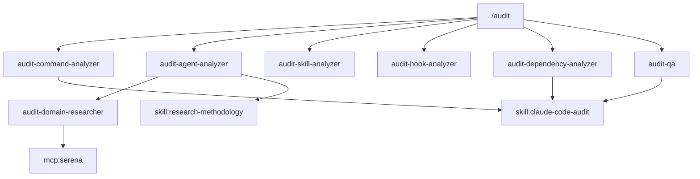

# Dependency Chain Patterns

Best practices for vertical dependency chains in Claude Code configurations.

## Overview

Vertical dependency chains trace relationships from entry points (commands) through execution layers (agents) to knowledge bases (skills) and external capabilities (MCPs). Healthy chains enable maintainability, debugging, and systematic improvement.

```
[Command] ─orchestrates─> [Agent(s)] ─references─> [Skill(s)] ─integrates─> [MCP(s)]
```

## Chain Types

### Command Chains

Commands are orchestrators that invoke agents in phases:

**Healthy Pattern**:
```
/audit (command)
├── Phase 2: audit-command-analyzer (parallel)
├── Phase 2: audit-agent-analyzer (parallel)
├── Phase 2: audit-skill-analyzer (parallel)
├── Phase 2: audit-hook-analyzer (parallel)
├── Phase 2: audit-dependency-analyzer (parallel)
└── Phase 2.5: audit-qa (synthesis)
```

**Anti-Pattern**:
```
/audit (command)
└── (directly invokes MCP without agents)
```

**Why**: Commands should delegate specialized work to agents. Direct MCP calls skip validation, logging, and reuse opportunities.

---

### Agent Chains

Agents may delegate to other agents or reference skills:

**Healthy Pattern**:
```
audit-agent-analyzer (sonnet)
├── Delegates: audit-domain-researcher (sonnet) [conditional]
└── References: research-methodology skill
```

**Anti-Pattern**:
```
audit-agent-analyzer
├── Calls: audit-qa (creates cycle risk)
└── (no skill reference for knowledge)
```

**Why**: Agents should flow downward (analyzer → researcher), never backward to synthesizers.

---

### Skill Chains

Skills contain knowledge and may include embedded agents/workflows:

**Healthy Pattern**:
```
.claude/skills/claude-code-audit/
├── SKILL.md              (knowledge + activation)
├── best-practices.md     (reference)
├── scoring-rubric.md     (criteria)
├── gap-patterns.md       (patterns)
└── dependency-patterns.md (this file)
```

**Active Skill Pattern** (with embedded execution):
```
.claude/skills/[domain]/
├── SKILL.md
├── workflows/           (executable workflows)
│   └── full-audit.md
└── agents/              (skill-specific agents)
    └── domain-checker.md
```

---

### MCP Integration Chains

MCP servers provide external capabilities accessed through tool calls:

**Healthy Pattern**:
```
[command] → [agent] → mcp__serena__* (symbolic analysis)
```

**Anti-Pattern**:
```
[command] → mcp__serena__* (no agent layer for error handling)
```

**Why**: Agent layer provides error handling, logging, and fallback behavior.

---

## Chain Health Metrics

### Link Validity

A valid link means the referenced component exists and is accessible.

```
validity_rate = valid_links / total_references
```

| Rate | Assessment |
|------|------------|
| 100% | Excellent |
| 95-99% | Good |
| 90-94% | Needs fixes |
| < 90% | Critical |

**Detection**: Parse component files for references, verify target exists.

---

### Circular Dependency Detection

Circular dependencies create infinite loops and undefined execution order.

**Common Circular Patterns**:
- Agent A calls Agent B, Agent B calls Agent A
- Command delegates to agent that invokes same command
- Skill references agent that references same skill

**Detection Algorithm** (DFS-based):
```
1. Build adjacency list from all references
2. For each unvisited node, run DFS
3. Track "recursion stack" of currently visiting nodes
4. If neighbor is in recursion stack, cycle found
5. Return all detected cycles
```

**Scoring**:
```
circular_score = 10 - (num_cycles × 2)
```
Clamp to minimum 0.

---

### Orphan Rate

Orphaned components are never referenced and may indicate dead code.

```
orphan_rate = orphaned_components / total_components
```

| Rate | Assessment |
|------|------------|
| < 5% | Excellent |
| 5-10% | Good |
| 10-20% | Needs cleanup |
| > 20% | Significant dead code |

**Note**: Some orphans are valid (e.g., standalone utilities, optional components).

---

### Chain Depth

Optimal depth balances validation opportunities with complexity.

| Depth | Assessment |
|-------|------------|
| 1 | Too shallow: Command → MCP direct, no validation |
| 2 | Minimal: Command → Agent → MCP |
| 3 | Good: Command → Agent → Skill → MCP |
| 4 | Maximum recommended |
| 5+ | Too deep: Review for consolidation |

**Scoring**:
```
if depth in [2, 3, 4]: score = 10
else: score = 10 - abs(depth - 3) × 2
```

---

### Chain Coverage

Measures how many MCPs are properly reached through chains.

```
coverage = connected_mcps / total_mcps
```

MCPs should be accessed through agent wrappers, not directly from commands.

---

## Dependency Extraction Algorithms

### Reference Patterns by Component Type

**Command → Agent**:
- Pattern: `**[agent-name].md**` or `[agent-name].md`
- Pattern: `Run [agent-name] with`
- Pattern: Task tool invocation mentioning agent
- Pattern: `audit-[name]-analyzer` naming convention

**Command → Skill**:
- Pattern: `Reference [skill-name]` in instructions
- Pattern: `/skill:workflow` invocation

**Agent → Skill**:
- Pattern: `Reference [skill].md` or `using [skill] skill`
- Pattern: Description mentioning skill name

**Agent → Agent** (delegation):
- Pattern: `Delegates to [agent]`
- Pattern: `Task tool` with agent reference

**Agent/Skill → MCP**:
- Pattern: `tools:` frontmatter containing `mcp__*`
- Pattern: Tool call syntax `mcp__[server]__[tool]`

### Building the Dependency Graph

```yaml
graph:
  nodes:
    - id: "cmd:audit"
      type: command
      file: "commands/audit.md"
    - id: "agent:audit-qa"
      type: agent
      file: "agents/audit-qa.md"
    - id: "skill:claude-code-audit"
      type: skill
      file: "skills/claude-code-audit/SKILL.md"
    - id: "mcp:serena"
      type: mcp
      config: ".mcp.json"
  edges:
    - from: "cmd:audit"
      to: "agent:audit-qa"
      type: "invokes"
      evidence: "Phase 2.5: Run audit-qa.md"
    - from: "agent:audit-qa"
      to: "skill:claude-code-audit"
      type: "references"
      evidence: "scoring-rubric.md from skill"
```

---

## Visualization Patterns

### ASCII Tree Format

For quick inline visualization:

```
[audit.md] (command)
├── [audit-command-analyzer.md] (agent:sonnet)
│   └── skill:claude-code-audit
├── [audit-agent-analyzer.md] (agent:sonnet)
│   ├── [audit-domain-researcher.md] (delegated)
│   └── skill:research-methodology
├── [audit-dependency-analyzer.md] (agent:sonnet)  ← NEW
│   └── skill:claude-code-audit
└── [audit-qa.md] (agent:sonnet)
    └── skill:claude-code-audit
```

### Mermaid Diagram Format

For detailed reports:



---

## Common Issues and Fixes

### Issue: Direct MCP Invocation

**Problem**: Command directly uses MCP without agent layer

**Symptoms**:
- No error handling for MCP failures
- No logging of MCP interactions
- Difficult to test or mock

**Fix**: Create thin wrapper agent for:
- Pre-call validation
- Error handling with retries
- Logging and observability
- Fallback behavior

---

### Issue: Orphaned Agent

**Problem**: Agent exists but no command or workflow references it

**Symptoms**:
- Agent file in `.claude/agents/`
- No references found in commands or other agents
- May be leftover from refactoring

**Fix Options**:
1. Add reference from appropriate command
2. Convert to skill-internal agent
3. Remove if truly unused
4. Document as standalone utility

---

### Issue: Deep Chain (5+ levels)

**Problem**: Command → Agent1 → Agent2 → Skill → Agent3 → MCP

**Symptoms**:
- Difficult to trace execution
- Performance overhead from delegation
- Context dilution across handoffs

**Fix**:
- Consolidate related agents
- Move shared logic to skill knowledge
- Reduce unnecessary delegation
- Consider parallel execution instead of sequential

---

### Issue: Missing Skill Reference

**Problem**: Agent performs domain work without referencing domain skill

**Symptoms**:
- Agent logic duplicates skill knowledge
- Updates to skill don't propagate
- Inconsistent approaches to same domain

**Fix**:
- Add skill reference in agent description
- Load skill knowledge at agent start
- Keep agent focused on orchestration, delegate knowledge to skill

---

### Issue: Circular Dependency

**Problem**: Components reference each other in a loop

**Symptoms**:
- A → B → A detected
- Execution order undefined
- Potential infinite recursion

**Fix**:
- Extract shared logic to neutral component
- Introduce direction (parent always calls child)
- Use skill for shared state instead of mutual calls
- Break cycle by restructuring responsibilities

---

## Sources

- [Anthropic Multi-Agent Systems](https://www.anthropic.com/engineering/multi-agent-research-system) - Orchestrator-worker pattern
- [Claude Code Best Practices](https://www.anthropic.com/engineering/claude-code-best-practices) - Subagent verification
- [Dependency Graphs in AI Agents](https://www.gocodeo.com/post/dependency-graphs-orchestration-and-control-flows-in-ai-agent-frameworks) - DAG patterns
- Static analysis patterns (call graph extraction)
