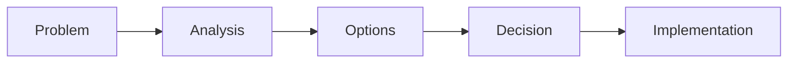

# Document Creation Skill

Provides patterns and structures for creating professional documents (Amazon 6-pagers, one-pagers, executive summaries). Auto-activates when tasks involve document creation, writing proposals, creating summaries, or preparing business communications.

## Activation Triggers

- Task type: "document", "proposal", "summary", "6-pager", "one-pager", "executive summary"
- Keywords: "write document", "create proposal", "summarize", "business case", "analysis document"
- File patterns: Creating `.md` files in docs/, deliverables/, or output/ directories

## Document Types

### Amazon 6-Pager (3000-3500 words)

Dense, narrative business documents for complex decisions.

**Structure:**
```
1. Executive Summary (300 words)
   - Key message upfront
   - Decision/recommendation

2. Context & Problem (500 words)
   - Background
   - Why now
   - Problem statement

3. Proposal/Solution (700 words)
   - Detailed approach
   - How it works
   - Why this solution

4. Analysis & Justification (800 words)
   - Data and evidence
   - Comparison to alternatives
   - ROI/benefits

5. Risks & Mitigations (400 words)
   - Known risks
   - Mitigation strategies
   - What could go wrong

6. Next Steps (300 words)
   - Immediate actions
   - Timeline
   - Decision required
```

**Style Rules:**
- Narrative prose, NOT bullet lists in main sections
- Data-driven: "reduced by 47%" not "significantly improved"
- Anticipate questions: address objections proactively
- No jargon without explanation

### One-Pager (500-800 words)

Concise executive summaries for quick decision-making.

**Templates:**

#### Problem-Solution
```markdown
# [Impactful Title]

## The Problem
[2-3 sentences: problem and impact]

## The Solution
[2-3 sentences: proposed solution]

## Key Benefits
- **[Benefit 1]:** [Brief explanation]
- **[Benefit 2]:** [Brief explanation]
- **[Benefit 3]:** [Brief explanation]

## Next Step
[Call-to-action - one sentence]
```

#### Executive Summary
```markdown
# [Title]

## TL;DR
[1-2 sentences - the most important takeaway]

## Context
[2-3 sentences of background]

## Key Findings
- [Finding 1]
- [Finding 2]
- [Finding 3]

## Recommendation
[1-2 sentences]

## Next Steps
1. [Action] - [Owner] - [Date]
2. [Action] - [Owner] - [Date]
```

#### Comparison
```markdown
# [Title]: Options Comparison

## Context
[2 sentences explaining what we're comparing]

| Criteria | Option A | Option B | Option C |
|----------|----------|----------|----------|
| [Criterion 1] | ... | ... | ... |
| [Criterion 2] | ... | ... | ... |

## Recommendation
**[Recommended Option]** because [primary reason].

## Trade-offs
[1-2 sentences on what we sacrifice]
```

#### Status Update
```markdown
# [Project]: Status Update

## Overall Status: [ON_TRACK | AT_RISK | BLOCKED]

[1 sentence summary]

## This Period
- [Completed 1]
- [Completed 2]
- [In Progress]

## Highlights
[1-2 key achievements]

## Blockers/Risks
- [Blocker]: [Mitigation]

## Next Period
- [ ] [Planned 1]
- [ ] [Planned 2]
```

## Quality Criteria

### Must Have
- Clear purpose statement
- Identified audience (C-Level, Management, Technical)
- Concrete data when available
- Explicit call-to-action or next steps
- Professional tone

### Avoid
- Vague language ("various", "significant", "many")
- Bullet-heavy main sections (6-pager)
- Missing conclusions or recommendations
- Over 800 words for one-pagers
- Under 2800 words for 6-pagers

## Workflow Integration

When `/develop-task` encounters a document creation task:

1. **Identify document type** from task description
2. **Determine audience** from context
3. **Select appropriate template**
4. **Apply style rules** during writing
5. **Validate** against quality criteria

## Mermaid Diagrams

Include when they add clarity:



Ask before adding complex diagrams to ensure they support the narrative.

## Related Skills

- presentation-creation: For slide decks from documents
- research-methodology: For gathering document content
- tdd-workflow: For validating document structure
