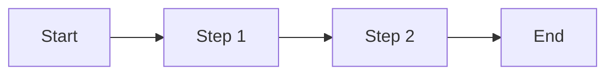
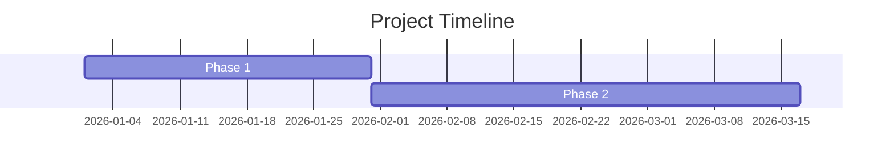
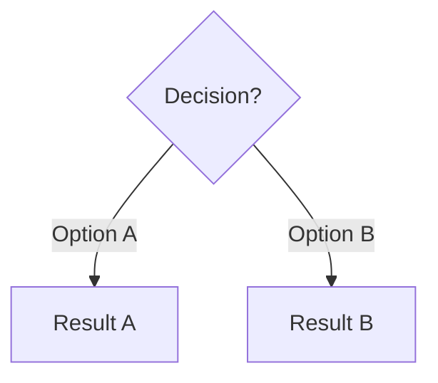

# Document Improvement Patterns

Techniques for improving existing documents through systematic reduction, clarity enhancement, and visual integration.

## Reduction Techniques

### 1. Eliminate Redundancy
- Remove repeated information across sections
- Consolidate similar points
- Cut filler phrases: "it is important to note that", "in order to"

### 2. Tighten Language
```
BEFORE: "In order to successfully achieve the goal of reducing costs"
AFTER: "To reduce costs"

BEFORE: "The team made the decision to implement"
AFTER: "The team implemented"
```

### 3. Replace Text with Visuals
- Long comparisons → Tables
- Process descriptions → Flowcharts
- Timelines → Gantt/Timeline diagrams
- Metrics → Dashboard-style callouts

### 4. Cut Low-Value Content
- Background that readers already know
- Excessive caveats and hedging
- Meta-commentary about the document itself

## Clarity Enhancement

### Narrative Flow
- Start each section with its main point
- Connect paragraphs with clear transitions
- End sections with implications or next steps

### Active Voice
```
BEFORE: "It was decided by the committee that"
AFTER: "The committee decided"
```

### Specific Over Vague
```
BEFORE: "significant improvements in performance"
AFTER: "47% reduction in page load time"
```

## Tone Standardization

### Professional Tone Checklist
- Remove contractions (don't → do not)
- Eliminate casual phrases ("pretty good", "kind of")
- Standardize terminology across document
- Match formality to audience

### C-Level Audience
- Bottom-line upfront
- Business impact emphasis
- Strategic framing
- Minimal technical detail

### Technical Audience
- Detail-first acceptable
- Include specifications
- Technical terminology okay
- Show your work

## Multi-Agent Quality Process

For significant improvements:

1. **Analyze** (fresh perspective)
   - Identify all issues objectively
   - Prioritize by severity

2. **Improve** (specialized execution)
   - Apply changes section by section
   - Track modifications

3. **Validate** (independent check)
   - Verify against quality criteria
   - Ensure no substance lost

4. **Review** (final pass)
   - Fresh perspective catch
   - Workshop/production readiness

## Visual Enhancement

### When to Add Diagrams
- Comparing 3+ items → Table
- Sequential process → Flowchart
- Timeline/milestones → Timeline
- Hierarchies → Tree diagram
- Relationships → Network diagram

### Diagram Guidelines
- One concept per diagram
- Clear labels
- Consistent styling
- Support the text, don't replace it

### Mermaid Templates

**Process Flow:**


**Comparison Timeline:**


**Decision Tree:**


## Quality Targets

| Metric | 6-Pager | One-Pager |
|--------|---------|-----------|
| Word Count | 3000-3500 | 500-800 |
| Sections | 6 | 3-5 |
| Diagrams | 2-4 | 0-1 |
| Bullet Ratio | <20% | <40% |
| Data Points | 5+ | 2-3 |
