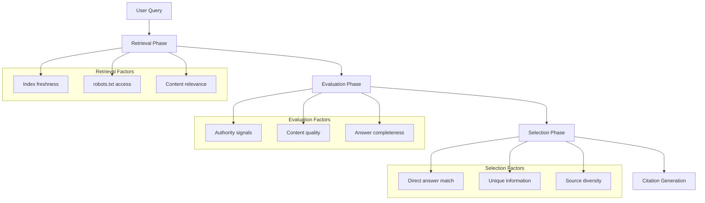

# Citation Optimization for AI Search

How to increase the probability of your content being cited in AI-generated answers. Understanding AI citation mechanics is essential for GEO success.

## How AI Models Select Citations

### The Citation Decision Process

AI models evaluate potential sources through multiple factors before including them in answers:



### Key Citation Factors

| Factor | Weight | Description |
|--------|--------|-------------|
| Direct answer match | High | Content directly answers the user's question |
| Unique data | High | Original statistics, research, or insights |
| Authority signals | High | E-E-A-T indicators, author expertise |
| Content freshness | Medium | Recently updated content |
| Structure clarity | Medium | Easy to extract information |
| Source diversity | Medium | AI prefers varied source types |

### What Gets Cited vs. What Gets Used

Important distinction:

- **Used**: AI may use information from many sources to formulate answers
- **Cited**: Only a subset of used sources appear as citations

To be **cited** (not just used), content must:
1. Contain unique, verifiable information
2. Be clearly attributable (author, organization)
3. Provide direct value to the answer
4. Stand out from generic information

---

## Content Structure for Citation Likelihood

### The "Citation-First" Format

Structure content to maximize citation probability:

```markdown
# [Question-Based Title]?

**TL;DR**: [40-60 word direct answer with key statistic]

*By [Author Name], [Credentials] | Updated: [Date]*

## Key Finding
[The single most important insight, prominently displayed]

## Supporting Data
| Metric | Value | Source |
|--------|-------|--------|
| [data point] | [value] | [source] |

## Methodology
[Brief explanation of how data was gathered]

## Full Analysis
[Detailed content...]
```

### Structural Elements That Increase Citations

| Element | Impact | Why It Works |
|---------|--------|--------------|
| Question-based titles | High | Matches user query patterns |
| First-paragraph answers | High | AI can extract without reading full page |
| Named frameworks | High | Becomes quotable ("The 4-Layer Framework") |
| Original statistics | High | Unique, citable information |
| Expert quotes | Medium | Attributed expertise |
| Comparison tables | Medium | Structured, extractable data |
| Definition blocks | Medium | Authoritative explanations |

### Content Length Guidelines

| Content Type | Optimal Length | Citation Section |
|--------------|----------------|------------------|
| Quick answer | 40-75 words | First paragraph |
| Definition | 50-100 words | Glossary/definition block |
| Process/How-to | 100-200 words per step | Individual steps |
| Analysis | 500-1500 words total | Key findings section |

---

## Authority Signals for AI

### Building AI-Recognizable Authority

AI systems evaluate authority differently than traditional search engines. They look for:

#### 1. Author Expertise Signals

```markdown
## About the Author

**[Name]** is a [title] at [Organization] with [X] years of experience in [field].

**Credentials**:
- [Credential 1]
- [Credential 2]
- [Publication/Speaking history]

**Contact**: [Professional links]
```

#### 2. Organizational Authority

| Signal | Implementation |
|--------|---------------|
| About page | Comprehensive organization description |
| Team page | Author bios with credentials |
| Press/media | Media mentions and features |
| Partnerships | Industry affiliations |
| Certifications | Industry certifications displayed |

#### 3. Content Authority Markers

| Marker | Example |
|--------|---------|
| Methodology disclosure | "This analysis is based on [X] data points from [source]" |
| Peer review | "Reviewed by [Expert Name], [Credentials]" |
| Update history | "Originally published [date], updated [date] with [changes]" |
| Source attribution | Inline citations to primary sources |

### Authority Hierarchy for AI

AI systems weight authority sources roughly in this order:

1. **Tier 1**: Peer-reviewed research, official documentation, government sources
2. **Tier 2**: Industry publications, established media, professional organizations
3. **Tier 3**: Company blogs with clear expertise, expert personal sites
4. **Tier 4**: General content sites, aggregators, user-generated content

---

## E-E-A-T for AI Search

### Traditional E-E-A-T vs. AI E-E-A-T

| Factor | Traditional SEO | AI Search (GEO) |
|--------|-----------------|-----------------|
| **Experience** | User signals, engagement | Content depth, practical examples |
| **Expertise** | Topical authority | Verifiable credentials, original data |
| **Authority** | Backlinks, domain age | Citation by other sources, expert attribution |
| **Trust** | HTTPS, reviews | Factual accuracy, source transparency |

### Implementing E-E-A-T for GEO

#### Experience Signals

```markdown
## Real-World Application

In our implementation of [topic] at [Company], we found:

1. **Challenge**: [specific problem]
2. **Solution**: [approach taken]
3. **Result**: [quantified outcome]

*Based on [timeframe] of production use with [scale] users.*
```

#### Expertise Signals

| Signal Type | Implementation |
|-------------|---------------|
| Author credentials | Display prominently near content |
| Data ownership | "Our proprietary research shows..." |
| Methodology | Explain how conclusions were reached |
| Limitations | Acknowledge scope and constraints |

#### Authority Signals

- **Cross-references**: Link to and from authoritative sources
- **Expert quotes**: Include named experts with credentials
- **Industry recognition**: Display awards, certifications
- **Media mentions**: Reference coverage by known outlets

#### Trust Signals

- **Fact-checking**: Include verification methods
- **Update policy**: Show content maintenance practices
- **Corrections**: Display correction history if applicable
- **Contact information**: Provide ways to verify claims

---

## Structured Data Impact on AI Citations

### Schema.org for AI Visibility

Structured data helps AI systems understand and extract information:

#### Essential Schema Types

| Schema Type | Use Case | Impact on GEO |
|-------------|----------|---------------|
| `Article` | Blog posts, news | Core content identification |
| `FAQPage` | Q&A content | Direct answer extraction |
| `HowTo` | Tutorials, guides | Step extraction |
| `Person` | Author pages | Expertise validation |
| `Organization` | Company pages | Authority establishment |
| `Review` | Product/service reviews | Opinion sourcing |

#### Article Schema Example

```json
{
  "@context": "https://schema.org",
  "@type": "Article",
  "headline": "Complete Guide to GEO in 2026",
  "author": {
    "@type": "Person",
    "name": "Expert Name",
    "url": "https://example.com/author",
    "jobTitle": "SEO Director",
    "worksFor": {
      "@type": "Organization",
      "name": "Company Name"
    }
  },
  "datePublished": "2026-01-01",
  "dateModified": "2026-01-13",
  "publisher": {
    "@type": "Organization",
    "name": "Publisher Name",
    "logo": {
      "@type": "ImageObject",
      "url": "https://example.com/logo.png"
    }
  }
}
```

#### FAQPage Schema for Q&A Content

```json
{
  "@context": "https://schema.org",
  "@type": "FAQPage",
  "mainEntity": [
    {
      "@type": "Question",
      "name": "What is GEO?",
      "acceptedAnswer": {
        "@type": "Answer",
        "text": "GEO (Generative Engine Optimization) is the practice of optimizing content to appear in AI-generated search results..."
      }
    }
  ]
}
```

### Structured Data Best Practices for GEO

| Practice | Rationale |
|----------|-----------|
| Use JSON-LD format | Most widely supported, cleanest implementation |
| Include author schema | Establishes expertise attribution |
| Add dateModified | Signals content freshness |
| Nest organization data | Builds authority context |
| Validate with tools | Ensure error-free implementation |

---

## Testing Citation Appearance

### Manual Testing Methods

#### 1. Direct Query Testing

Test your content's citation potential by querying AI platforms:

| Platform | How to Test |
|----------|-------------|
| ChatGPT | Ask questions your content answers, check citations |
| Perplexity | Search for your topic, look for numbered citations |
| Claude | Query with search enabled, review source references |
| Gemini | Use Deep Research, check source cards |

#### 2. Testing Queries

Create test queries that should surface your content:

```
Your content topic: "Best practices for AI crawler configuration"

Test queries:
- "How do I configure robots.txt for AI crawlers?"
- "What is GPTBot and how do I allow it?"
- "AI crawler best practices 2026"
- "[Your brand] AI crawler guide"
```

#### 3. Competitive Analysis

Compare your citation rate against competitors:

1. Identify top 5 competitors for your topic
2. Run same queries across AI platforms
3. Track which sources get cited
4. Analyze why competitors are/aren't cited

### Citation Tracking Tools

| Tool | Capabilities | Coverage |
|------|--------------|----------|
| Otterly.ai | Citation tracking, brand monitoring | ChatGPT, Perplexity |
| Rankscale | AI search visibility | Multiple platforms |
| Ahrefs Brand Radar | AI mention tracking | AI platforms + web |
| Profound.ai | AI search analytics | ChatGPT, Perplexity, Claude |
| Manual tracking | Custom spreadsheet | All platforms |

### Key Metrics to Track

| Metric | Description | Target |
|--------|-------------|--------|
| Citation frequency | How often cited across queries | Increasing trend |
| Citation position | Position in numbered citations | Top 3 preferred |
| Query coverage | % of relevant queries where cited | > 30% |
| Platform distribution | Which platforms cite you | Multi-platform |
| Competitor comparison | Your citations vs. competitors | Parity or better |

### Testing Checklist

- [ ] Query each major AI platform weekly
- [ ] Track citation appearances in spreadsheet
- [ ] Compare against 3-5 competitors monthly
- [ ] Monitor for citation position changes
- [ ] Test new content within 2 weeks of publishing
- [ ] Re-test after major content updates

---

## Quick Reference: Citation Optimization Checklist

### Content Creation

- [ ] Question-based title matching user queries
- [ ] Direct answer in first 40-75 words
- [ ] Author name and credentials visible
- [ ] Publication and update dates displayed
- [ ] Original data or statistics included
- [ ] Named frameworks or methodologies
- [ ] Expert quotes with attribution

### Technical Implementation

- [ ] robots.txt allows AI crawlers
- [ ] Article schema with author data
- [ ] FAQPage schema for Q&A content
- [ ] JSON-LD format (not microdata)
- [ ] Schema validated error-free

### Authority Building

- [ ] Author bio page exists
- [ ] Credentials verifiable
- [ ] Methodology disclosed
- [ ] Sources cited inline
- [ ] Update history visible

### Testing & Monitoring

- [ ] Manual query testing monthly
- [ ] Citation tracking tool configured
- [ ] Competitor monitoring active
- [ ] Performance baseline established

