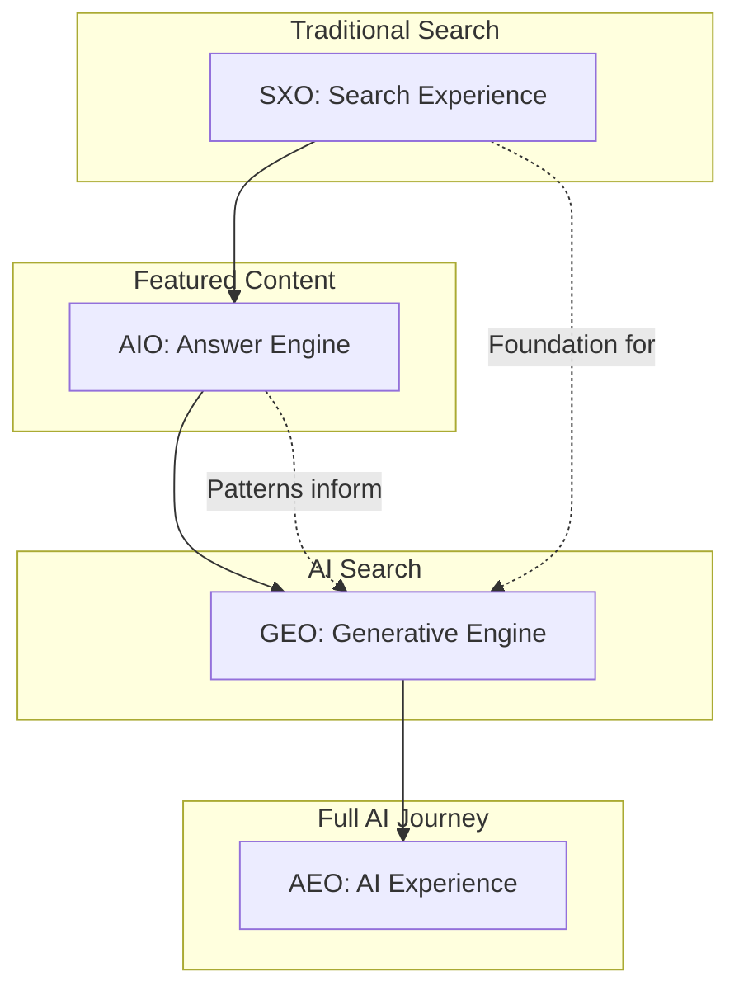

# Four-Layer Search Optimization Framework

The modern search ecosystem requires optimization across multiple layers. This framework organizes the progression from traditional search to full AI-powered experiences.

## Layer Overview



## Layer Definitions

### Layer 1: SXO (Search Experience Optimization)

**Definition**: Optimizing the entire search journey from query to conversion, combining SEO with UX principles.

**Focus Areas**:
- Click-through rate optimization
- Landing page experience
- User intent matching
- Mobile-first design
- Core Web Vitals

**Relationship to GEO**: SXO creates the authority foundation that AI systems use when evaluating sources. Strong SXO correlates with higher GEO citation rates.

**When to Prioritize**:
- Building new site authority
- Optimizing for Google/Bing clicks
- Improving conversion rates
- All projects (foundational layer)

---

### Layer 2: AIO (Answer Engine Optimization)

**Definition**: Optimizing content to appear in direct answer formats like featured snippets, knowledge panels, and "People Also Ask" boxes.

**Focus Areas**:
- Featured snippet targeting
- Question-based content structure
- Schema.org structured data
- FAQ markup
- How-To content format

**Relationship to GEO**: AIO patterns (clear Q&A structure, concise answers) directly transfer to GEO. Content optimized for featured snippets performs well in AI answers.

**When to Prioritize**:
- Informational content
- How-to guides and tutorials
- FAQ pages
- Product/service comparisons

---

### Layer 3: GEO (Generative Engine Optimization)

**Definition**: Optimizing content to be cited in AI-generated responses from ChatGPT, Perplexity, Claude, Gemini, and similar platforms.

**Focus Areas**:
- AI crawler access (robots.txt)
- Citation-worthy content structure
- E-E-A-T signals for AI
- Original data and statistics
- Answer-first formatting

**Key Differences from SEO**:

| Aspect | Traditional SEO | GEO |
|--------|-----------------|-----|
| Success Metric | Clicks, rankings | Citations, mentions |
| Visibility | SERP position | Inclusion in answer |
| Competition | Top 10 results | Any cited source |
| Outcome | Traffic | Brand authority |

**When to Prioritize**:
- Thought leadership content
- Industry-specific expertise
- Product/brand visibility
- Any 2025+ digital strategy

---

### Layer 4: AEO (AI Experience Optimization)

**Definition**: Optimizing the complete user experience within AI-powered interfaces, including conversational interactions and multi-turn dialogues.

**Focus Areas**:
- Conversational content design
- Multi-query journey mapping
- AI assistant integrations
- Voice/audio optimization
- Contextual relevance signals

**Emerging Considerations**:
- AI browser experiences (ChatGPT Atlas)
- Agent-based interactions
- Automated form fills
- Conversational commerce

**When to Prioritize**:
- Voice-first products
- AI-integrated services
- Customer service automation
- Forward-looking strategies

---

## Layer Interaction Matrix

| Scenario | Primary Layer | Supporting Layers | Notes |
|----------|---------------|-------------------|-------|
| New website launch | SXO | - | Build foundation first |
| Existing site, AI visibility | GEO | SXO, AIO | Leverage existing authority |
| FAQ/How-to content | AIO | SXO, GEO | Structure benefits all layers |
| Thought leadership | GEO | AIO | Citation focus |
| Voice assistant | AEO | GEO, AIO | Full stack needed |
| E-commerce product | SXO | AIO, GEO | Conversion + visibility |

## Decision Matrix: Which Layer to Focus

```
Start Here:
│
├─ Do you have established search authority?
│   ├─ NO → Focus on SXO first
│   └─ YES → Continue...
│       │
│       ├─ Is your content appearing in featured snippets?
│       │   ├─ NO → Focus on AIO
│       │   └─ YES → Continue...
│       │       │
│       │       ├─ Are AI crawlers accessing your content?
│       │       │   ├─ NO → Configure robots.txt (GEO technical)
│       │       │   └─ YES → Continue...
│       │       │       │
│       │       │       ├─ Are you being cited in AI answers?
│       │       │       │   ├─ NO → Focus on GEO content optimization
│       │       │       │   └─ YES → Optimize for AEO (advanced)
```

## Layer-Specific Checklists

### SXO Checklist
- [ ] Core Web Vitals passing (LCP < 2.5s, CLS < 0.1, INP < 200ms)
- [ ] Mobile-responsive design
- [ ] Clear navigation and IA
- [ ] Fast page load times
- [ ] Intuitive user flows

### AIO Checklist
- [ ] Question-based H2 headers
- [ ] Concise answer paragraphs (40-75 words)
- [ ] FAQ schema markup
- [ ] How-To schema where applicable
- [ ] "People Also Ask" coverage

### GEO Checklist
- [ ] robots.txt allows AI crawlers
- [ ] Answer-first content structure
- [ ] Original data/statistics included
- [ ] Author bios and expertise signals
- [ ] Visible update timestamps
- [ ] Schema.org Article markup

### AEO Checklist
- [ ] Conversational content tone
- [ ] Multi-intent content coverage
- [ ] Action-oriented CTAs
- [ ] Voice search optimization
- [ ] Context-aware responses

## Measurement by Layer

| Layer | Primary Metrics | Tools |
|-------|-----------------|-------|
| SXO | Rankings, CTR, conversions | Google Search Console, analytics |
| AIO | Featured snippet wins, PAA appearances | SEMrush, Ahrefs |
| GEO | AI citations, brand mentions | Otterly.ai, Rankscale, Ahrefs Brand Radar |
| AEO | Voice query performance, AI interaction quality | Custom tracking, user research |

## Common Anti-Patterns

| Anti-Pattern | Layer | Why It Fails |
|--------------|-------|--------------|
| Blocking all AI crawlers | GEO | Zero visibility in AI answers |
| Keyword stuffing | All | AI detects low-quality content |
| Thin content | GEO | Not citation-worthy |
| Missing author info | GEO | E-E-A-T signals absent |
| Outdated content | GEO | AI prefers fresh sources |
| No structured data | AIO, GEO | Harder for engines to extract |
