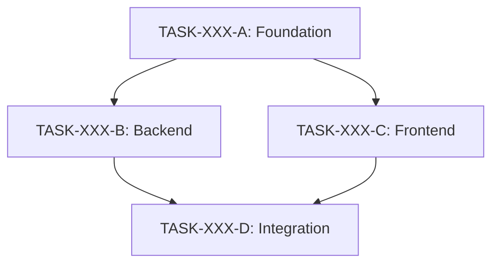

# Task Decomposition Framework

This framework helps break down complex tasks (complexity >= 7) into manageable subtasks. It provides 5 strategies for decomposition and guidance on when to use each.

## When to Use Decomposition

Decomposition is suggested when:
- Complexity score >= 7 (from Phase 1.5)
- Code Impact agent identifies > 10 files affected
- Multiple independent work streams identified
- Task crosses multiple architectural boundaries
- Estimated duration > 1 week
- Multiple skill sets required

## The 5 Decomposition Strategies

### Strategy 1: Vertical Slice (Feature-based)

**When to use:**
- Task involves multiple distinct user-facing features
- Each slice delivers end-to-end value
- Features can be released independently
- UI/UX components are separable

**Pattern:**
```
Original Task → Feature A + Feature B + Feature C

Example:
"Build user profile system" →
  - TASK-XXX-A: User profile display page
  - TASK-XXX-B: Profile settings and preferences
  - TASK-XXX-C: Notification preferences
  - TASK-XXX-D: Account management (password, email)
```

**Characteristics:**
- Each subtask is a complete vertical slice
- Subtasks can often run in parallel
- Dependencies are minimal between slices
- Good for agile/incremental delivery

**Questions to ask:**
1. "Can this feature be split into independently valuable parts?"
2. "Which parts deliver the most user value earliest?"
3. "Are there natural user journey boundaries?"

---

### Strategy 2: Horizontal Layer (Technical-based)

**When to use:**
- Task spans full technical stack (frontend, backend, database)
- Clear technical boundaries exist
- Different expertise needed per layer
- Infrastructure changes required

**Pattern:**
```
Original Task → Backend + Frontend + Database + Infrastructure

Example:
"Implement real-time chat" →
  - TASK-XXX-A: Chat backend API and WebSocket server
  - TASK-XXX-B: Chat frontend components and state
  - TASK-XXX-C: Message persistence and history
  - TASK-XXX-D: Presence and typing indicators
```

**Characteristics:**
- Subtasks follow technical architecture
- May have sequential dependencies (backend before frontend)
- Enables specialist focus
- Good for complex technical implementations

**Questions to ask:**
1. "Which layer is the foundation that others depend on?"
2. "Can any layers be developed in parallel?"
3. "What are the contracts/interfaces between layers?"

---

### Strategy 3: Incremental Enhancement (MVP-based)

**When to use:**
- Feature has clear MVP and enhancement path
- Early feedback desired before full implementation
- Complexity comes from polish, not core functionality
- Risk of scope creep

**Pattern:**
```
Original Task → MVP + Enhancement 1 + Enhancement 2 + Polish

Example:
"Build analytics dashboard" →
  - TASK-XXX-A: Basic metrics display (MVP)
  - TASK-XXX-B: Date range filters and comparisons
  - TASK-XXX-C: Interactive charts and visualizations
  - TASK-XXX-D: Export and sharing capabilities
```

**Characteristics:**
- Strictly sequential (MVP must complete first)
- Each increment adds value on top of previous
- Enables early validation
- Good for uncertain requirements

**Questions to ask:**
1. "What is the minimum viable version?"
2. "Which enhancements add the most value?"
3. "What can we learn from shipping MVP early?"

---

### Strategy 4: Dependency Chain (Prerequisite-based)

**When to use:**
- Clear technical prerequisites exist
- One component must work before others can start
- Integration points define natural boundaries
- External dependencies involved

**Pattern:**
```
Original Task → Foundation → Integration → Consumer → Polish

Example:
"Implement OAuth login" →
  - TASK-XXX-A: OAuth provider configuration
  - TASK-XXX-B: Callback handling and token management
  - TASK-XXX-C: Account linking and user creation
  - TASK-XXX-D: Login UI and error handling
```

**Characteristics:**
- Strictly sequential dependencies
- Each step unlocks the next
- Good for integration-heavy work
- Helps identify blockers early

**Questions to ask:**
1. "What must exist before anything else can work?"
2. "What are the integration points between components?"
3. "Where are the external dependencies?"

---

### Strategy 5: Risk Isolation (De-risk-based)

**When to use:**
- High-risk changes (database migrations, breaking changes)
- Need to validate approach before full implementation
- Rollback capability required
- Production safety critical

**Pattern:**
```
Original Task → Research → Spike → Dual-write → Verify → Cutover → Cleanup

Example:
"Migrate database schema" →
  - TASK-XXX-A: Research migration options and risks
  - TASK-XXX-B: Implement migration in staging
  - TASK-XXX-C: Add dual-write capability
  - TASK-XXX-D: Verify data integrity
  - TASK-XXX-E: Production cutover
  - TASK-XXX-F: Cleanup old schema
```

**Characteristics:**
- Safety-first approach
- Multiple verification points
- Rollback possible at each stage
- Good for production-critical changes

**Questions to ask:**
1. "What could go wrong and how bad would it be?"
2. "How can we verify each step before proceeding?"
3. "What's our rollback plan at each stage?"

---

## Strategy Selection Guide

| Signal | Recommended Strategy |
|--------|---------------------|
| Multiple user features | Vertical Slice |
| Full-stack implementation | Horizontal Layer |
| MVP → enhancement path clear | Incremental |
| Integration dependencies | Dependency Chain |
| High-risk or reversibility needed | Risk Isolation |

**When multiple strategies apply:**
1. Consider the primary risk or concern
2. Prefer strategy that enables parallel work
3. Choose strategy matching team structure
4. Default to Vertical Slice for product features

---

## Decomposition Process

### Step 1: Confirm Decomposition

Present to user (per user preference - always ask first):
```
This task appears complex (score: X/10).

Complexity factors identified:
- [N] files affected
- [cross-cutting concerns]
- [integration points]

Would you like me to analyze decomposition options?
[Y]es - Show decomposition strategies
[N]o - Proceed as single task
```

### Step 2: Strategy Analysis

If user chooses Yes, analyze agent findings to recommend strategy:

```
## Decomposition Analysis

Based on agent findings, I recommend **[Strategy Name]**.

### Why this strategy:
- [Reason 1 from agent findings]
- [Reason 2 from agent findings]

### Alternative strategies considered:
- [Other strategy]: [Why not preferred]

### Proposed subtasks:

1. **TASK-XXX-A**: [Title]
   - Scope: [What's included]
   - Dependencies: None
   - Complexity: [N]/10

2. **TASK-XXX-B**: [Title]
   - Scope: [What's included]
   - Dependencies: TASK-XXX-A
   - Complexity: [N]/10

3. **TASK-XXX-C**: [Title]
   - Scope: [What's included]
   - Dependencies: TASK-XXX-A, TASK-XXX-B
   - Complexity: [N]/10

### Dependency diagram:
TASK-XXX-A → TASK-XXX-B → TASK-XXX-C
                ↘ TASK-XXX-D (parallel)

### Benefits of decomposition:
- Smaller, reviewable chunks
- Earlier feedback opportunities
- Parallel work possible on [X, Y]
- Reduced risk per task

Options:
[D]ecompose - Create these subtasks
[A]djust - Modify the decomposition
[P]roceed - Keep as single task
[R]e-scope - Reduce original scope instead
```

### Step 3: Create Subtasks

If user chooses Decompose:

1. **Create parent task** (TASK-XXX):
   ```yaml
   ---
   id: TASK-XXX
   type: [type]
   status: in_progress
   is_decomposed: true
   subtasks: [TASK-XXX-A, TASK-XXX-B, TASK-XXX-C]
   ---

   # [Original Title]

   ## Decomposition

   This task has been decomposed into [N] subtasks:

   | Subtask | Title | Status | Dependencies |
   |---------|-------|--------|--------------|
   | TASK-XXX-A | [title] | backlog | - |
   | TASK-XXX-B | [title] | backlog | TASK-XXX-A |
   | TASK-XXX-C | [title] | backlog | TASK-XXX-B |

   ## Original Description
   [original task description preserved]
   ```

2. **Create each subtask** (TASK-XXX-A, TASK-XXX-B, etc.):
   ```yaml
   ---
   id: TASK-XXX-A
   type: [type]
   status: backlog
   parent_task: TASK-XXX
   depends_on: []
   ---

   # [Subtask Title]

   Part of: [[TASK-XXX]]

   ## Scope
   [specific scope for this subtask]

   ## Acceptance Criteria
   [criteria specific to this subtask]
   ```

3. **Update tasks.json**:
   - Add parent task with `is_decomposed: true`
   - Add all subtasks with `parent_task` reference
   - Set up dependency chain

---

## Naming Convention

| Task Type | ID Format |
|-----------|-----------|
| Parent task | TASK-XXX |
| Subtasks | TASK-XXX-A, TASK-XXX-B, TASK-XXX-C, ... |
| Nested subtasks (rare) | TASK-XXX-A1, TASK-XXX-A2 |

**Rules:**
- Maximum 7 subtasks per parent (A through G)
- If more needed, consider parent task scope reduction
- Subtasks inherit type from parent unless specified
- Subtask IDs are stable (don't rename even if parent changes)

---

## Dependency Management

### Dependency Types

| Type | Notation | Meaning |
|------|----------|---------|
| Hard | `depends_on: [TASK-XXX-A]` | Cannot start until dependency complete |
| Soft | `after: [TASK-XXX-A]` | Should start after, but can overlap |
| Parallel | No dependency | Can run concurrently |

### Dependency Rules

1. **Avoid circular dependencies** - tasks cannot depend on each other
2. **Minimize chain length** - deep dependency chains create bottlenecks
3. **Enable parallelism** - prefer wide trees over long chains
4. **Document external dependencies** - note blockers outside task system

### Dependency Visualization

Include in parent task:
```
## Dependency Graph



Critical path: A → B → D (or A → C → D)
```

---

## Complexity Redistribution

When decomposing, redistribute complexity appropriately:

| Original | Strategy | Typical Distribution |
|----------|----------|---------------------|
| 7/10 | Any | 3-4 subtasks, 2-4 each |
| 8/10 | Vertical Slice | 4-5 subtasks, 2-4 each |
| 9/10 | Horizontal or Risk | 5-6 subtasks, 3-4 each |
| 10/10 | Risk Isolation | 6-7 subtasks with verification steps |

**Rule:** Sum of subtask complexities should approximate original + 20% overhead

---

## Anti-patterns to Avoid

### Don't:
- Create subtasks that are too small (< complexity 2)
- Create subtasks that still feel overwhelming (> complexity 5)
- Split tasks that have no natural boundaries
- Decompose when the task is unclear (clarify first)
- Create dependencies between unrelated subtasks

### Do:
- Keep subtasks independently testable
- Ensure each subtask has clear acceptance criteria
- Make parent task status reflect subtask progress
- Document why decomposition was chosen
- Review decomposition if requirements change

---

## Integration with /generate-task

This framework is automatically activated in Phase 1.5 when complexity >= 7.

**Flow:**
1. Phase 1.5 scores complexity
2. If score >= 7, user is asked about decomposition
3. If user agrees, this framework guides the analysis
4. Subtasks are created using the same /generate-task validation
5. Parent task tracks overall progress

**Agent Integration:**
- Code Impact agent findings inform file-based decomposition
- Test Planning agent helps verify subtasks are testable
- Research agent findings inform strategy selection
