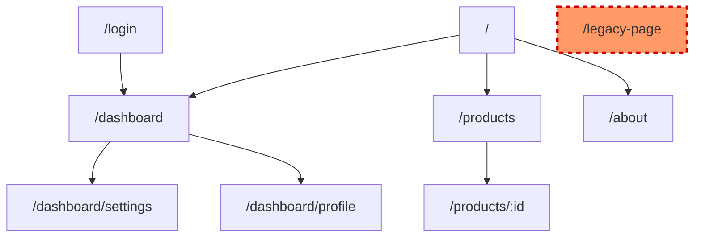
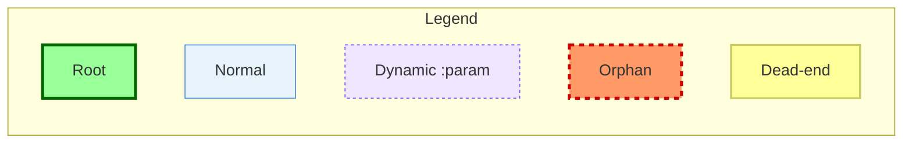
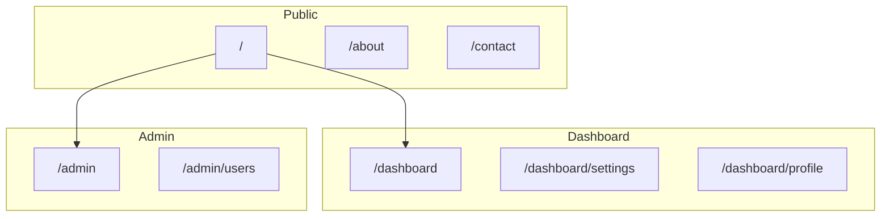

# Visualization Templates

Templates for rendering navigation flow graphs in ASCII tree format (terminal) and Mermaid diagram format (documentation/PRs).

## When to Use These Templates

- After `journey-validator` agent produces JSON output
- When displaying navigation structure in terminal
- When generating Mermaid diagrams for PRs or documentation
- When creating visual reports of route connectivity

## ASCII Tree Template

### Format Structure

```
Navigation Flow ({total} routes, {orphans} orphans)
├── / (root)
│   ├── /dashboard
│   │   ├── /dashboard/settings
│   │   └── /dashboard/profile
│   ├── /products
│   │   └── /products/:id
│   └── /about
├── /login → /dashboard (auth flow)
└── ⚠️ /legacy-page (ORPHAN - no inbound links)
```

### Tree Symbols

| Symbol | Meaning |
|--------|---------|
| `├──` | Branch with siblings below |
| `└──` | Last branch at this level |
| `│` | Vertical continuation |
| `→` | Navigation flow indicator |
| `⚠️` | Warning indicator (orphan/dead-end) |

### Status Prefixes

| Prefix | Status | Description |
|--------|--------|-------------|
| (none) | Normal | Connected route |
| `⚠️` | Orphan | No inbound links (in-degree = 0) |
| `🔚` | Dead-end | No outbound links (allowed terminal) |
| `🏠` | Root | Entry point (/ path) |

### Summary Line Format

```
Navigation Flow ({total} routes, {orphans} orphans, {dead_ends} dead-ends)
```

---

## Mermaid Graph Template

### Basic Structure



### Node ID Mapping

Convert route paths to valid Mermaid node IDs:

```javascript
function pathToNodeId(path) {
  if (path === "/") return "root";
  return path
    .replace(/^\//, "")      // Remove leading /
    .replace(/\//g, "_")     // Replace / with _
    .replace(/:/g, "")       // Remove : from params
    .replace(/-/g, "_");     // Replace - with _
}
```

**Examples**:
| Path | Node ID |
|------|---------|
| `/` | `root` |
| `/dashboard` | `dashboard` |
| `/products/:id` | `products_id` |
| `/user-settings` | `user_settings` |
| `/api/v1/users` | `api_v1_users` |

---

## Color/Status Indicators

### classDef Styles

| Style | Fill | Stroke | Purpose |
|-------|------|--------|---------|
| `root` | `#9f9` (green) | `#060` | Entry point (/) |
| `normal` | `#e8f4fc` (light blue) | `#4a90d9` | Connected routes |
| `dynamic` | `#f0e6ff` (light purple) | `#7c4dff` | Dynamic routes (`:param`) |
| `orphan` | `#f96` (orange-red) | `#c00` | No inbound links |
| `deadend` | `#ff9` (yellow) | `#cc6` | No outbound links |

### Style Definitions

```mermaid
classDef root fill:#9f9,stroke:#060,stroke-width:3px
classDef normal fill:#e8f4fc,stroke:#4a90d9
classDef dynamic fill:#f0e6ff,stroke:#7c4dff,stroke-dasharray:3 3
classDef orphan fill:#f96,stroke:#c00,stroke-width:3px,stroke-dasharray:5 5
classDef deadend fill:#ff9,stroke:#cc6,stroke-width:2px
```

### Applying Styles

```mermaid
root["/"]:::root
dashboard["/dashboard"]:::normal
productId["/products/:id"]:::dynamic
legacy["/legacy"]:::orphan
logout["/logout"]:::deadend
```

---

## Legend Template

### Horizontal Legend (for documentation)



### ASCII Legend (for terminal)

```
Legend:
  🏠 Root      - Entry point (/)
  ○  Normal    - Connected route
  ◇  Dynamic   - Route with :params
  ⚠️  Orphan    - No inbound links
  🔚 Dead-end  - No outbound links (terminal)
```

### Edge Types

| Edge | Syntax | Meaning |
|------|--------|---------|
| Primary | `A --> B` | Direct navigation link |
| Optional | `A -.-> B` | Conditional navigation |
| Back | `A --> B` (cycle) | Return/back navigation |

---

## JSON Integration

### Input Schema (from journey-validator)

```json
{
  "analysis_metadata": {
    "timestamp": "2026-01-13T14:30:00Z",
    "framework": "react-router",
    "framework_confidence": 95
  },
  "routes": {
    "total": 15,
    "list": [
      { "path": "/", "file": "src/pages/index.tsx", "type": "static" },
      { "path": "/products/:id", "file": "src/pages/products/[id].tsx", "type": "dynamic" }
    ]
  },
  "navigation_graph": {
    "nodes": 15,
    "edges": 28,
    "avg_out_degree": 1.87
  },
  "orphans": {
    "count": 2,
    "list": [
      { "path": "/legacy-page", "file": "src/pages/legacy.tsx", "reason": "no_inbound_links" }
    ],
    "severity": "WARNING"
  },
  "dead_ends": {
    "count": 1,
    "list": [
      { "path": "/logout", "file": "src/pages/logout.tsx", "allowed": true }
    ],
    "allowed_terminals": ["/logout", "/error"]
  },
  "journeys": {
    "declared": 3,
    "validated": 2,
    "coverage": 0.92,
    "gaps": [
      { "journey": "checkout_flow", "missing_step": "/checkout/confirm" }
    ]
  },
  "health_score": 8.5
}
```

### Field Mapping

| JSON Field | ASCII Template | Mermaid Template |
|------------|----------------|------------------|
| `routes.total` | Summary line `{total}` | Comment header |
| `routes.list[].path` | Tree node label | Node label in brackets |
| `routes.list[].type` | (none) | `:::dynamic` class |
| `orphans.list[].path` | `⚠️` prefix | `:::orphan` class |
| `dead_ends.list[].path` | `🔚` prefix | `:::deadend` class |
| `health_score` | Footer line | Subgraph title |

### Edge Case Handling

| Scenario | ASCII Handling | Mermaid Handling |
|----------|----------------|------------------|
| Empty graph | "No routes found" | Empty diagram with note |
| Single route | Just root node | Single node with root class |
| Circular deps | Show cycle indicator | Bidirectional arrows |
| 50+ routes | Truncate with "..." | Use subgraphs |

---

## Large Graph Optimization

### Subgraph Grouping (50+ routes)



### Grouping Heuristics

1. Group by first path segment (`/dashboard/*`, `/admin/*`)
2. Limit to 10 nodes per subgraph
3. Show inter-group edges only
4. Expand subgraphs on demand

---

## Usage Examples

### Small Graph (< 10 routes)

**Input**: 5 routes, 1 orphan

**ASCII Output**:
```
Navigation Flow (5 routes, 1 orphan)
├── / (root)
│   ├── /dashboard
│   └── /about
├── /login → /dashboard
└── ⚠️ /old-page (ORPHAN)
```

### Medium Graph (10-50 routes)

**Input**: 25 routes, 3 orphans, 2 dead-ends

**Mermaid Output**: Full graph with all classDef styles applied

### Large Graph (50+ routes)

**Input**: 100 routes across 8 sections

**Mermaid Output**: Subgraphs by path prefix, inter-group edges only
